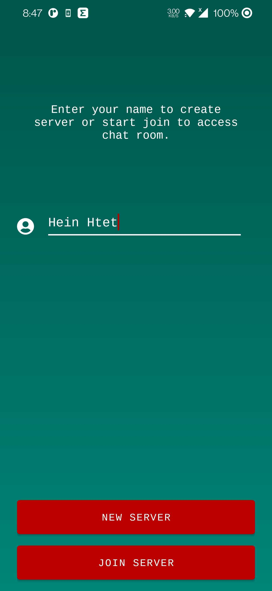
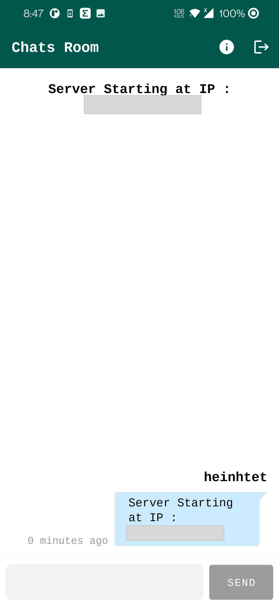
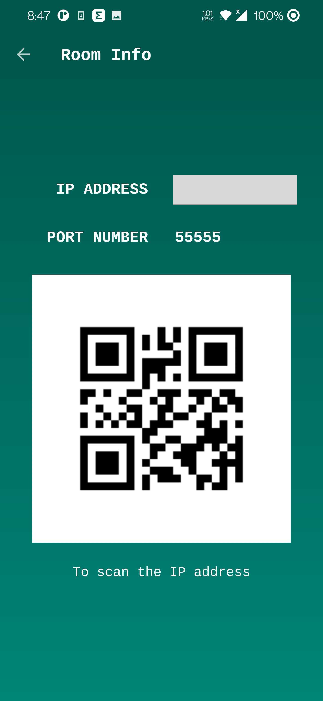
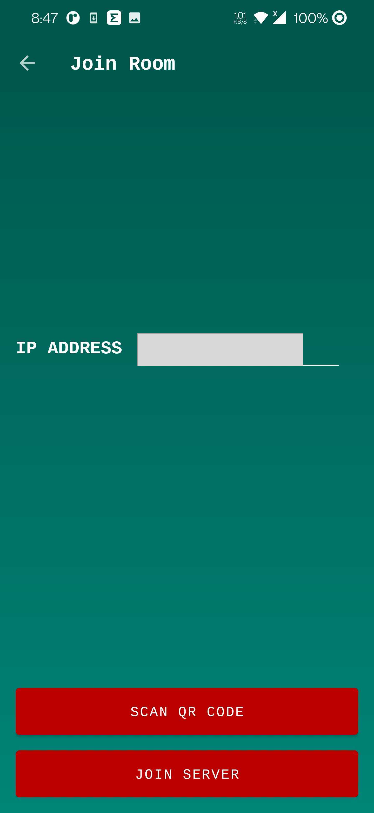
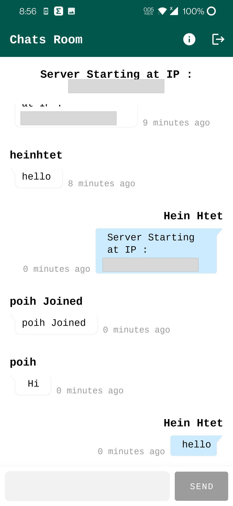

# WI-FI Chat

Wifi Chat is a small demo application based on modern Android application tech-stacks and MVVM architecture. This project is for focusing especially on the new library Hilt of implementing dependency injection and which is allows devices connected to the samw WI-FI to communicate through chat.

## Screenshopts

## Architecture

* [MVVM Architecture](https://www.googleadservices.com/pagead/aclk?sa=L&ai=DChcSEwjK3u72jYPxAhVVh0sFHXXjDYUYABAAGgJzZg&ohost=www.google.com&cid=CAESQOD2XFcmPuIcTP24qAGRLr8lgw8-kVpWnbHw3glvNILr8B9UyDMpPQB-5vYiruWMF09MN4gx1oRC40CNYeifO4E&sig=AOD64_1HcbJ9FuCgqd4WZrhRJItLyvCd9w&q&adurl&ved=2ahUKEwjj-uX2jYPxAhWyzjgGHag1BUEQ0Qx6BAgCEAE) (View - Databinding - ViewModel - Model)
* Repository pattern

## Tech stack & Open-source libraries

* [Kotlin](https://developer.android.com/kotlin?gclid=Cj0KCQjw5PGFBhC2ARIsAIFIMNcxqbwHscrWV99P1uNM2TlC4ePTeJrBhZ-0Od2pUZOKox6CyWmO85QaAhYOEALw_wcB&gclsrc=aw.ds) based, [Coroutines](https://developer.android.com/kotlin/coroutines?gclid=Cj0KCQjw5PGFBhC2ARIsAIFIMNcDLo3-0f-EqAFXKbqDjkAJS8VCf-6BVP9xABZlVN1Vgj3eVW15SL8aAkogEALw_wcB&gclsrc=aw.ds) for asynchronous.
* [Hilt](https://developer.android.com/training/dependency-injection/hilt-android)
* [Android JetPack](https://developer.android.com/jetpack?gclid=Cj0KCQjw5PGFBhC2ARIsAIFIMNeNBS7HMrBCiuGX20lMHkq62UckuQ9wgOhTvFN8-vpRU9ChODgjlz4aAl5SEALw_wcB&gclsrc=aw.ds)
* [Lifecycle](https://developer.android.com/topic/libraries/architecture/lifecycle) - dispose of observing data when lifecycle state changes.
* [ViewModel](https://developer.android.com/reference/android/arch/lifecycle/ViewModel) - UI related data state holder and life cycle aware.
* [Material Components ](https://material.io/develop/android/docs/getting-started)- Material design component UI related.

## License

Designed and developed by 2021 Hein Htet

Licensed under the Apache License, Version 2.0 (the "License");
you may not use this file except in compliance with the License.
You may obtain a copy of the License at

   http://www.apache.org/licenses/LICENSE-2.0

Unless required by applicable law or agreed to in writing, software
distributed under the License is distributed on an "AS IS" BASIS,
WITHOUT WARRANTIES OR CONDITIONS OF ANY KIND, either express or implied.
See the License for the specific language governing permissions and
limitations under the License.

